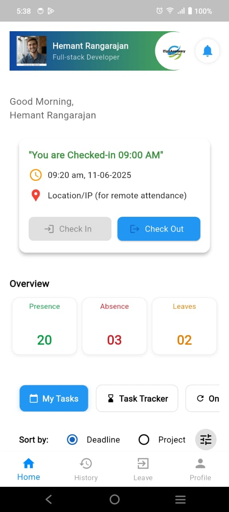
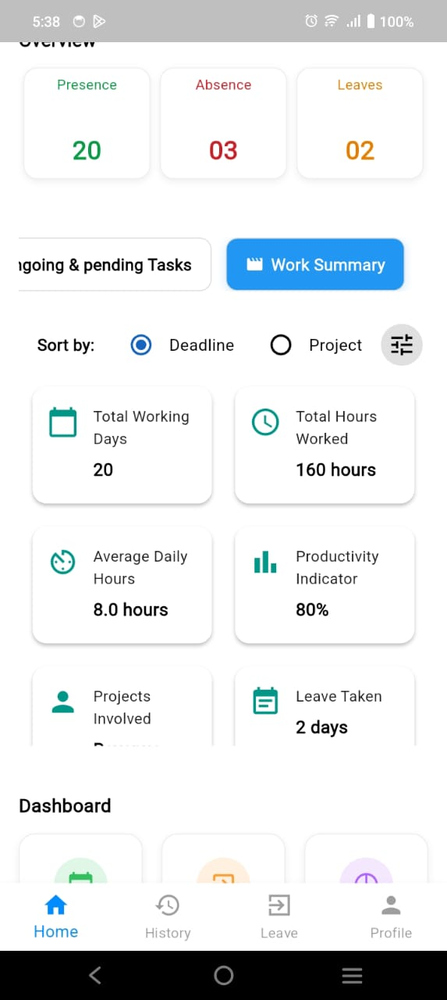
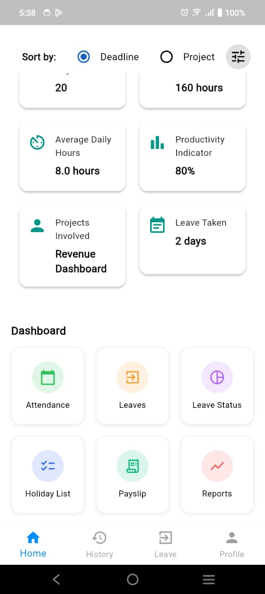

# Flutter Attendance Dashboard UI

A modern and responsive attendance dashboard built using **Flutter**, mimicking the Ziya Academy app UI with:
- Green header with profile, company logo, and notification bell
- Greeting section with Check-In / Check-Out buttons
- Overview stats (Presence, Absence, Leaves)
- Dashboard grid (Attendance, Leaves, Leave Status, etc.)
- Bottom navigation bar

---

## 📱 Features

- Horizontal tab navigation with smooth switching
- Dynamic content rendering based on selected tab
- Task cards with progress indicators and priority status
- Sorting options (by Deadline or Project)
- Work summary tab with quick stats
- Visually appealing UI using Flutter Material design

---

## 🚀 Getting Started

### Prerequisites

- Flutter SDK (3.10+ recommended)
- Dart
- Android Studio or VS Code
## 📸 Screenshots

### 🏠 Home Screen
,
,
,
,
,
